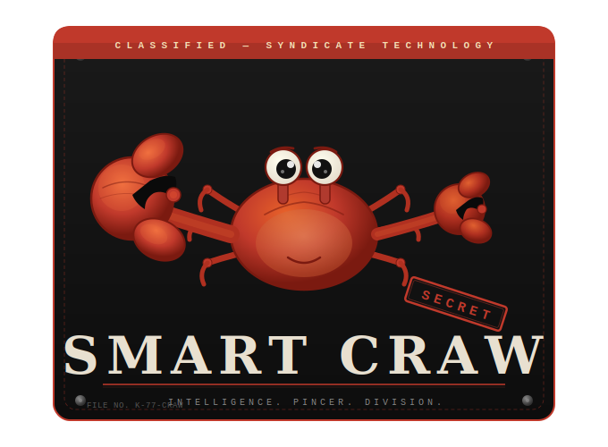
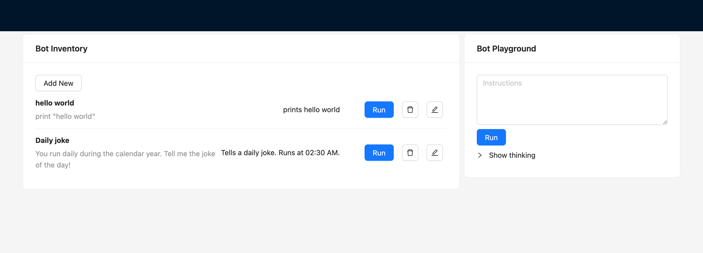

# Smart Craw

## Get Smart!  Its not Claw, its Craw!

Want to access your bots from anywhere?  Want to easily stop them if they are going haywire?  Want to easily schedule them?

## Missed it by that much

Claude Code is great, and Anthropic's new mobile app makes remote access a flip-switch.  But who wants to pay 200 dollars a month for a mobile app?  Based on Anthropic's agent SDK, this gives you full control of bots without ponying up for a premium.

Features:
* UI to create, view, schedule, start, and stop bot execution
* Chat interface playground to test and explore

Architecture:
* ReactJS UI
* NodeJS server
* Anthropic's SDK

## What if I told you 2 bots and a self-hosted model?

Any model that works with Anthropic's API can be used.  Want a fully private experience in a sandboxed environment?  Here is your chance!

## Get smarted!

Store memories for later use:
`mkdir memory`

Run docker container, mounting current directory for the persistent storage and the memory directory for bot-specific memories.  Works if you are locally hosting a model via Ollama.  `add-host` is optional on Windows/Mac.

`docker run -p 8000:8000 -v $(pwd):/app/db -v $(pwd):/app/bots -v $(pwd)/memory:/home/node/.claude -v $(pwd):/app/smart-craw-server --add-host=host.docker.internal:host-gateway  ghcr.io/smart-craw/smart-craw:v0.1.1`

Run with remote or public LLM:

`docker run -p 8000:8000 -e ANTHROPIC_BASE_URL=[yourllmurl] -e ANTHROPIC_AUTH_TOKEN=[yourauthtoken] -e ANTHROPIC_API_KEY=[yourapikey] -v $(pwd):/app/db -v $(pwd):/app/bots  -v $(pwd)/memory:/home/node/.claude --add-host=host.docker.internal:host-gateway ghcr.io/smart-craw/smart-craw:v0.1.1`

On a Mac, you need to proxy remote calls through your host.  A simple way to do that is to run something like `socat TCP-LISTEN:9000,fork TCP:[yourllmurl]` in a seperate terminal (or using nohup), and then set `http://host.docker.internal:9000` as your ANTHROPIC_BASE_URL.  Alternatively, run the [example script](./example/startup_mac.sh) passing in `[yourllmurl]` (without the "http://") and the docker tag (eg, `v0.1.1`) as the arguments to the script.

### All available environment variables

Full env variables:
* ANTHROPIC_BASE_URL (defaults to "http://host.docker.internal:11434", local Ollama)
* ANTHROPIC_AUTH_TOKEN (defaults to "ollama")
* ANTHROPIC_API_KEY (defaults to "sk-local-dummy")
* LOG_LEVEL (defaults to "info")
* MODEL (model to use, eg "hf.co/Qwen/Qwen3-4B-GGUF:latest").  Does not matter if backend server is llama-server.
* START_THINK_TOKEN (start token for thinking, defaults to "<think>")
* END_THINK_TOKEN (start token for thinking, defaults to "</think>")

## Design Approach

Your bot fleet is constrained to the folder that you mount into your docker container. Each new bot will have its own directory within this folder.  If you want a bot to act on a set of files (code or other text documents) you must put them inside the bot's directory.  To do this, mount the docker `/app/bots` directory into your file system.

Claude keeps "memories" for each bot.  Mount docker's `/home/node/.claude` into your file system to persistently store bot memories.  If this memory isn't mounted your bots will "lose" their memory on every pod restart.

## Cautions

This is intended for local and trusted networks.  An ideal setup would be to run this and access it on a local workstation.  The LLM service can be hosted elsewhere.

If you run this on a Raspberry Pi and access the UI "remotely" it is strongly recommended to set static IPs and block all traffic except from your workstation.  Similarly, if you want to access this from your phone on your local network, have your local router assign a static IP to your phone and block all traffic except from your phone.

I may at some point set up authentication which would allow exposure to a wider array of (LAN) endpoints, but I still would urge caution and tight network restrictions.

Under no circumstances should you host this on a cloud system or expose your ports outside of your LAN.

## Screenshot

