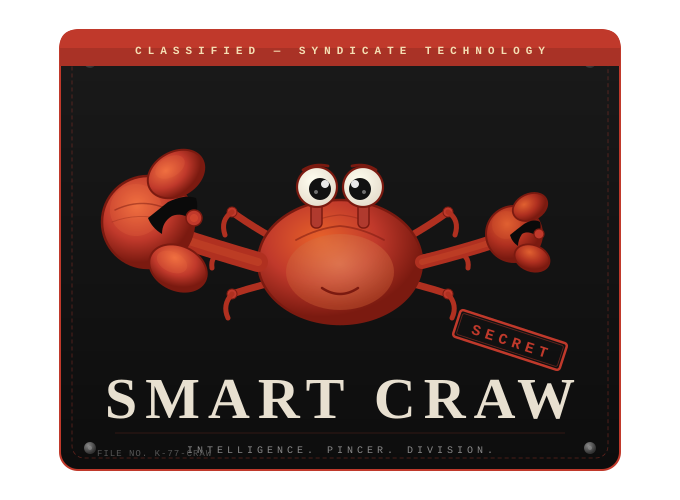
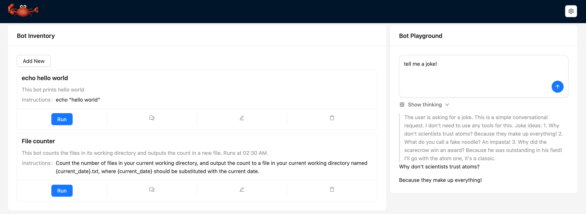

# Smart Craw



## Get Smart!  Its not Claw, its Craw!

Want to access your bots from anywhere?  Want to easily stop them if they are going haywire?  Want to easily schedule them?

## Missed it by that much

Claude Code is great, and Anthropic's new mobile app makes remote access a flip-switch.  But who wants to pay 200 dollars a month for a mobile app?  Based on Anthropic's agent SDK, this gives you full control of bots without ponying up for a premium.

Features:
* UI to create, view, schedule, start, and stop bot execution
* Chat interface playground to test and explore

Architecture:
* ReactJS UI
* NodeJS server
* Strands' SDK
* Signal server for accessing remotely

## What if I told you 2 bots and a self-hosted model?

Any model that works with Anthropic's API can be used.  Want a fully private experience in a sandboxed environment?  Here is your chance!

## Get smarted!

### Local agent, run in Docker
Store memories for later use:
`mkdir memory`

Run docker container, mounting current directory for the persistent storage and the memory directory for bot-specific memories.  Works if you are locally hosting a model via Ollama.  `add-host` is optional on Windows/Mac.

```sh
docker run -p 8000:8000 -v $(pwd):/app/db \
-v $(pwd):/app/bots \
-v $(pwd)/memory:/app/memory \
--add-host=host.docker.internal:host-gateway \
ghcr.io/smart-craw/smart-craw:v0.2.3
```

Run with remote or public LLM:

```sh
docker run -p 8000:8000 -v $(pwd):/app/db \
-v $(pwd):/app/bots \
-v $(pwd)/memory:/app/memory \
-e OPEN_API_COMPATIBLE_ENDPOINT=[yourllmurl] \
--add-host=host.docker.internal:host-gateway \
ghcr.io/smart-craw/smart-craw:v0.2.3
```

On a Mac, you need to proxy remote calls through your host.  A simple way to do that is to run something like `socat TCP-LISTEN:9000,fork TCP:[yourllmurl]` in a seperate terminal (or using nohup), and then set `http://host.docker.internal:9000` as your OPEN_API_COMPATIBLE_ENDPOINT.  Alternatively, run the [example script](./example/startup_mac.sh) passing in `[yourllmurl]` (without the "http://") and the docker tag (eg, `v0.2.3`) as the arguments to the script.  Eg, `./example/startup_mac.sh llm.home:8080 v0.2.3 "<|channel>" "<channel|>"`.

### Full app with Docker Compose

Modify [docker-compose](./docker/docker-compose.yml) with your relevant variables ([smart-craw-server](#smart-craw-server-available-environment-variables), [smart-craw-signal](#smart-craw-signal-env-variables)).  The run `docker compose -f docker-compose.yml up`.  Note that you can mix and match: only run agent and ui, or only run the app with Signal based on your needs.


# Architecture

This is a mono-repo with [smart-craw-server](./smart-craw-server) as a back-end agent factory, [smart-craw-signal](./smart-craw-signal) as a stripped-down Signal server, and [smart-craw-ui](./smart-craw-ui) as the front-end assets.

## Smart Craw server

### Design Approach

Your bot fleet is constrained to the folder that you mount into your docker container. Each new bot will have its own directory within this folder.  If you want a bot to act on a set of files (code or other text documents) you must put them inside the bot's directory.  To do this, mount the docker `/app/bots` directory into your file system.

Mount docker's `/app/memory` into your file system to persistently store bot memories.  If this memory isn't mounted your bots will "lose" their memory on every pod restart.

### Network Topology and Security

For ease of use I've given the agent carte blanche.  There is no approval requests for the `bash`, `fileEditor`, or (optional) `mcpCodeClient`.  This requires tight controls elsewhere to ensure that any deleterious actions have a small blast radius.  The [docker-compose](./docker/docker-compose.yml) helps to reduce this blast radius.

Docker itself provides some sandboxing.  For example, the agent can only operate on host files via the mounted volume.  The agent could change directory, but will only be traversing directories in the docker container itself.  The agent does NOT have write access to its own code within the docker container.

### Private Networks

The network topology limits what the agent service and the code mcp service can access.  The agent can only access github.com, npmjs.com, pypi.org, and the LLM Api. the code mcp service can only access github.com, npmjs.com, and pypi.org.  Programatically the agent service only accesses the LLM Api.



### Cautions

This is intended for local and trusted networks.

If you run this on a Raspberry Pi and access the UI "remotely" it is strongly recommended to set static IPs and block all traffic except from your workstation.  Similarly, if you want to access this from your phone on your local network, have your local router assign a static IP to your phone and block all traffic except from your phone.

I may at some point set up authentication which would allow exposure to a wider array of (LAN) endpoints, but I still would urge caution and tight network restrictions.

Under no circumstances should you host this on a cloud system or expose your ports outside of your LAN.

### Smart Craw Server available environment variables

Full env variables:
* OPEN_API_COMPATIBLE_ENDPOINT (defaults to `http://host.docker.internal:11434`, local Ollama)
* LOG_LEVEL (defaults to `info`)
* START_THINK_TOKEN (start token for thinking, defaults to `<think/>`)
* END_THINK_TOKEN (start token for thinking, defaults to `</think>`)
* MCP_SERVER_LIST.  JSON string array of MCP urls

## Smart Craw UI

### Screenshot



## Smart Craw Signal

### Get a free phone number from Google

If you have a Google account you can create a new free phone number.

### Install openjdk on mac

`brew install openjdk`

### Register (sends SMS verification code)

`./node_modules/signal-sdk/bin/signal-cli -a +1[number] register`

### Verify with the code received

`./node_modules/signal-sdk/bin/signal-cli -a +1[number] verify [number]`

### Run with docker compose

Setup:

```sh
# create a place for claude to put persistent files
mkdir $HOME/signal/storage/memory

# allow group writes (for both the agent and mcp services to access)
chmod -R 775 $HOME/signal/storage

# keep group consistent for new files
chmod g+s $HOME/signal/storage
```

Modify [docker-compose](./docker/docker-compose.yml) with your relevant [env](#env-variables) variables.  The run `docker compose -f docker-compose.yml up`.

Run at startup:

Put your (modified) [docker-compose](./docker/docker-compose.yml) in `$HOME/signal/docker`.  Place your [service](./service/llm-signal.service) in `~/.config/systemd/user/`.

Then:

```sh
systemctl --user daemon-reload
systemctl --user enable llm-signal
systemctl --user start llm-signal
sudo loginctl enable-linger $USER
```

### Smart Craw Signal Env variables

* OPEN_API_COMPATIBLE_ENDPOINT (defaults to "http://host.docker.internal:11434", local Ollama.  If using docker compose, don't update this in `docker-compose.yml`...instead update the BACKEND_SERVICE environment variable for `nginx`.)
* LOG_LEVEL (defaults to "info")
* START_THINK_TOKEN (start token for thinking, defaults to "<think>")
* END_THINK_TOKEN (start token for thinking, defaults to "</think>")
* SIGNAL_BOT_PHONE_NUMBER (your free phone number from Google)
* SIGNAL_USER_ADMIN_NUMBER (your actual phone number)
* SIGNAL_REST_ENDPOINT (endpoint exposed by signal server docker, defaults to http://localhost:9001)
* MCP_SERVER_LIST.  JSON string array of MCP urls

These can also be placed in a .env file.

### Run signal server locally

```sh
docker run  -p 9001:8080 \
    -v $HOME/.local/share/signal-cli:/home/.local/share/signal-cli \
    -e MODE=json-rpc-native bbernhard/signal-cli-rest-api:0.100-rootless
```

### Run

```sh
cd smart-craw-signal
node index.ts
```

### Run CLI without Signal for debugging

```sh
cd smart-craw-signal
MOCK=yes node index.ts
```
